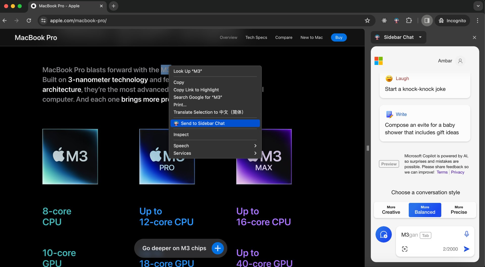

# Sidebar Chat

Copilot in the browser sidebar.

The sidebar offers a convenient and persistent presence within the browser, allowing users to access AI-powered assistance without disrupting their browsing workflow. Whether it's seeking quick answers to questions, receiving intelligent suggestions, or engaging in in-depth discussions, the sidebar serves as a reliable companion, always ready to assist.

## Usage

Use the hotkey Command+B (Ctrl+B for Windows) to open it, or select **Send to Sidebar Chat** in the context menu:

